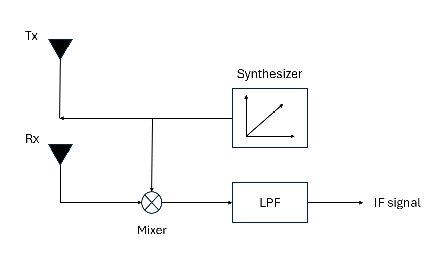

# 硬體架構

> 本章聚焦毫米波雷達硬體組成、訊號流動路徑以及主要元件功能。

毫米波雷達的核心目標，是將高頻射頻訊號 (RF) 轉換為容易處理的低頻訊號 (IF)，再透過數位訊號處理 (DSP) 萃取出目標的距離、速度與角度資訊。

上圖為一張調頻連續波 (FMCW) 雷達系統的架構方塊圖，展示雷達系統從發射到混頻，接著再到低通濾波，最後得到中頻訊號 (IF) 的過程。

## 原理
首先，頻率合成器（Frequency Synthesizer）會產生頻率隨時間線性變化的訊號（也就是先前提到的 `chirp` 訊號），同時提供給發射天線（Tx antenna）與混頻器（Mixer）。發射天線接著將來自頻率合成器的訊號發射出去。

 

之後目標將發射出去的無線電波反射回來，被接收天線（Rx antenna）接收。Mixer 便將接收到的回波信號與剛才的發射信號（來自 synthesizer）相乘。混頻器的本質其實是將本地訊號（LO）與接收訊號（RF）相乘。在相乘後，會同時產生「和頻（fRF + fLO）」與「差頻（fRF – fLO）」兩個成分。其中差頻就是我們要的拍頻（beat frequency），而和頻（通常是高頻分量）則會透過後續的濾波器去除。

 

由於我們最感興趣的是這兩個訊號的頻率差 Δf（也稱為 中頻訊號 Intermediate Frequency（IF）Signal）。因此，我們接著利用 LPF（低通濾波器 Low Pass Filter），將 Mixer 輸出中的高頻（和頻）濾除，消除雜訊並分離出有用的距離/速度資訊。

 

最終，經過 LPF 濾波後，得到的就是純粹的 IF 訊號，這個訊號的頻率直接與目標的距離和相對速度相關。在後續中，這個 IF Signal 會被送入類比數位轉換器 (Analog-to-Digital Converter, ADC) 進行數位化，然後由藉由數位訊號處理器（Digital Signal Processor, DSP）進行快速傅立葉變換（FFT）處理，最終提取出目標的精確距離、速度和角度資訊。
