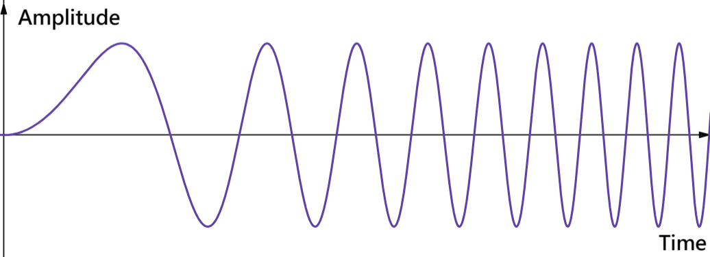

# 毫米波基礎

> 本章統整毫米波雷達的核心原理、常用公式與設計邏輯，為後續訊號處理、演算法、應用等章節奠定共同的理解基礎。  

## 什麼是毫米波？
毫米波（mmWave）是一種波長約 **1–10** 毫米、頻率 **30–300** GHz 的高頻電磁波，位於電磁波譜中微波與紅外線之間。由於其波長短、頻率高，因此一方面既能提供極大的頻寬，支援高速資料傳輸；另一方面也因波長短，亦能實現高解析度的感測能力。

## 應用場景與案例
毫米波雷達廣泛應用於汽車領域，例如盲點偵測、緊急自動煞車、智慧跟車系統（ACC）、行人偵測等，能在雨天、濃霧或夜間等低能見度環境下依然精準測距並判斷角度，大幅提升自動駕駛與行車安全。

 

近年來，其應用更拓展至智慧感測與人機互動，例如以毫米波雷達進行手勢識別、跌倒偵測、室內定位，不需攝影機即可實現非接觸式操作。在醫療與生命體徵監測方面，毫米波能夠精準量測心跳、呼吸頻率與微小動作，可用於智慧醫院、居家照護與長者安全監測。未來，隨著硬體與演算法的進步，毫米波技術有望在穿戴式裝置、智慧家庭、無人駕駛車輛等領域發揮更關鍵的角色。

## FMCW
Frequency Modulated Continuous Wave，調頻連續波，通過發射頻率隨時間線性變化的連續波，並分析接收到的回波信號（透過比較發射與接收訊號）來測量距離和速度。計算頻率差可得到距離；而計算頻率變化率可得速度。

 

 

上圖顯示的是 FMCW 雷達訊號的隨時間變化的波形圖，縱軸是振幅，橫軸是時間。從圖可以看到一開始波形較稀疏（頻率低）。隨著時間推進，波形越來越密集（頻率升高），這正是 FMCW 透過線性調頻 (chirp[^note])，讓發射信號的頻率隨時間變化。

[^note]: Chirp 這個名稱由來其實還滿有趣。當訊號的頻率隨時間線性增加或減少，會聽到一種「嘰——啾——」的掃頻聲，跟小鳥叫聲非常接近（我個人也覺得確實滿像的啦）。

 

因為FMCW 發射的是是連續波，接收端可以即時比較「發射信號」與「回波信號」之間的差異。當信號遇到目標反射回來時，會有一個時間延遲。因為頻率是隨時間改變的，這個延遲就會轉換成頻率差 (beat frequency)。FMCW 雷達利用這個頻率差來計算目標的距離。FMCW 雷達透過比較「發射」與「接收」訊號的頻率差，計算出距離，若進一步量測頻率差隨時間的變化，還可以估算速度（都卜勒效應）。

 

如果想了解更多，請參考 [TI Radar Academy - How Does Radar Work?](https://dev.ti.com/tirex/explore/node?node=A__AXNV8Pc8F7j2TwsB7QnTDw__RADAR-ACADEMY__GwxShWe__LATEST)

## MIMO 雷達
Multiple-Input Multiple-Output，多輸入多輸出，是一種在雷達系統中被廣泛使用的技術，它利用多個發射天線（Tx）和多個接收天線（Rx）來提高雷達的整體性能。MIMO 雷達的核心概念是利用空間維度的優勢，透過發射不同的正交訊號並在接收端分離它們，來模擬出一個更大的虛擬天線陣列，而非僅僅依賴於時間或頻率維度。相較之下，傳統的雷達系統通常是單輸入單輸出 (Single-input single-output, SISO)，即只有一個發射天線和一個接收天線。

#### 虛擬陣列 MIMO 雷達 
Virtual Antenna Array MIMO Radar，則是目前雷達領域更常討論和應用的一種 MIMO 雷達。由於多個發射天線發射的訊號彼此正交（Orthogonal），所以每個發射天線發射的訊號在接收端接收訊號時可以被區分開來。透過虛擬陣列，MIMO 雷達可以形成一個更大的天線陣列。想像一下，假設原本只有 NTx 個發射天線和 NRx 個接收天線，那麼接收端可以同時接收到 NTx × NRx ​個獨立的「發射-接收路徑」訊號。這相當於擁有了 NTx × NRx 個虛擬感測器，使得雷達系統能夠：

- 提高角度解析度：一個更大的虛擬孔徑可以分辨出更近的目標。例如一個 2 Tx × 4 Rx 的虛擬陣列 MIMO 雷達可以達到與 8 個物理單一天線一樣的角度解析度。

- 提高目標分離能力：MIMO 增加了虛擬天線數目，可以區分角度非常接近的目標與雜波來源。

- 抑制干擾和雜波：藉由波束形成（beamforming），雷達可以加強特定方向的訊號，同時降低其他方向的干擾或雜波。

- 實現更精確的測量：對目標的距離、速度和角度估計可以更準確。

 

如果想了解更多，請參考 [TI Radar Academy - Antenna Design](https://dev.ti.com/tirex/explore/node?node=A__AYACbFbxKXPkH52Vd6GNSA__RADAR-ACADEMY__GwxShWe__LATEST)

 

#### 為什麼需要正交訊號？
在 MIMO 雷達中，當來自不同發射天線的訊號同時到達，接收器需要明確地辨識出每一個回波訊號是來自哪一個特定的發射天線，這時候，我們就需要讓每個發射天線所發射的訊號都具備正交性（或可區分性，distinguishable）。讓發射訊號具備正交性是實現虛擬陣列的基礎。如果接收器無法區分回波訊號，那麼所有回波訊號將會混疊在一起，也無法提取出每個獨立的「發射-接收路徑」資訊了。

 

#### 那麼該如何實現訊號的正交性？
要讓發射訊號具備正交性主要有三種方法：

- 分時多工 (Time Division Multiplexing, TDM)：不同的發射天線在不同的時間片 (time slots) 發射訊號，也就是說，同一時間點，只有一個發射天線在發送訊號。由於發射天線間需要輪流發射，完成一個完整的掃描週期需要更長的時間，因此缺點是更新率會下降。

- 分頻多工 (Frequency Division Multiplexing, FDM)：不同的發射天線在不同的頻率範圍或起始頻率發射訊號，或讓它們的 chirp 訊號根據不同的頻率去做偏移。這個方法避免了上述分時多工一次只能一個發射的缺點，但是需要分離不同頻率的訊號。

- 分碼多工 (Code Division Multiplexing, CDM)：讓每個發射天線發射一個具有獨特編碼序列的訊號，且這些編碼序列彼此之間的相關性低。這個方法一樣可以避免上述分時多工一次只能一個發射的缺點，但是接收端需要進行解碼和相關運算來分離不同發射源的訊號。

 

這邊做個舉例，幫助大家理解：

想像一下，你有很多支不同顏色的筆 (NTx 個發射天線，發射正交訊號)，它們在各自的位置發射訊號。同時，你有很多張不同顏色的紙張 (NRx 個接收天線)，它們在各自的位置接收訊號。當你拿起一支藍色的筆 (Tx1) 開始寫字，同時這些字被所有不同顏色的紙張 (Rx1, Rx2, ..., Rx_NRx) 接收並記錄下來。然後你拿起一支紅色的筆 (Tx2) 繼續寫字，這些字也被所有不同顏色的紙張 (Rx1, Rx2, ..., Rx_NRx) 接收並記錄下來。

由於每支筆的「顏色」（訊號）都是獨特的（正交的），所以即使所有紙張都接收到了混合的字跡，它們都能透過辨識顏色的特徵（解碼/處理），來分辨出是由哪支筆寫的內容。這樣，對於每一張紙來說，它都能「看到」由每支筆 (Tx) 寫下的內容。 因此，每一支筆 (Tx) 在其位置發射的訊號，被每一張紙 (Rx) 在其位置接收，就構成了一個獨立的「發射點-接收點」路徑，這個路徑所提供的資訊，就相當於一個虛擬感測器。

 

在這個例子中：

1. 不同顏色的筆 = 不同發射天線（Tx）
    - 每支筆寫的顏色都獨特 → 對應到「每個發射天線發送正交的訊號」。
    - 正交的特性保證了後續可以分開辨識。

2. 不同顏色的紙 = 不同接收天線（Rx）
    - 每張紙都能接收到所有筆的字跡 → 就像每個接收天線都會接收到來自所有發射天線的訊號。
    - 筆寫字 + 紙接收
    - 當某一支筆在它的位置寫字時，所有紙都會記錄下來，代表「所有 Rx 都接收來自同一 Tx 的訊號」。
    - 之後換另一支筆寫，所有紙再一次接收，代表「所有 Rx 又接收另一個 Tx 的訊號」。

3. 顏色解碼
    - 雖然紙上有多種顏色的字跡，但因為顏色不一樣（訊號正交），接收端可以分辨並還原是哪支筆寫的 → 對應到「解調/相關運算」。
    - 一支筆（Tx_i） × 一張紙（Rx_j） = 一條獨立的路徑。
    - 每一組 Tx–Rx 對應到一個「虛擬感測器」。
    - 所以 NTx × NRx → 形成 NTx × NRx 個虛擬天線。

 

在實際雷達裡，這些「顏色」不一定是可見的不同顏色，而是：

- 時域正交（TDM-MIMO）：不同時間發射 → 好像每次只拿一支筆來寫，輪流進行。
- 頻域正交（FDM-MIMO）：不同頻率 → 每支筆用不同墨水頻譜。
- 編碼正交（CDM-MIMO）：不同編碼 → 每支筆寫的字有獨特花紋。

 

如果想更了解 MIMO 雷達的正交性，請參考 [MIMO-OFDM](https://en.wikipedia.org/wiki/MIMO-OFDM)

 
 
 
 
